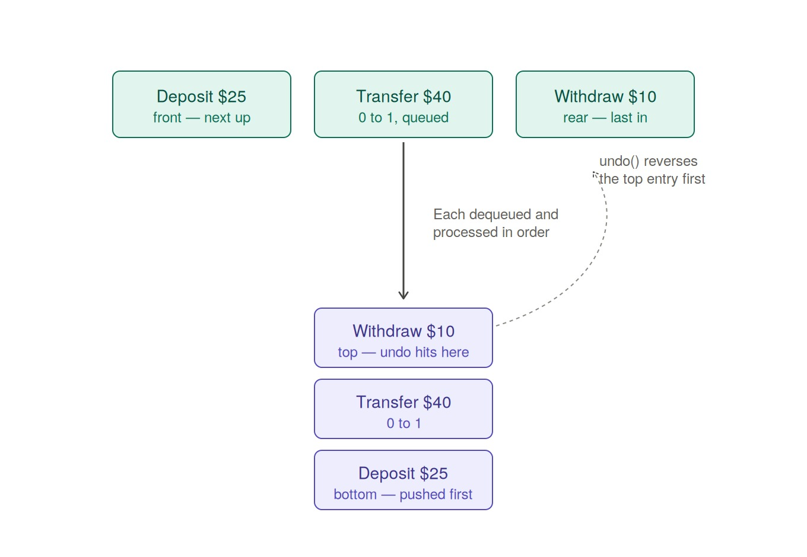

# Diagram

## Diagram Explanation

This is a queue and stack trace for BroBank, based on the demo run in
`03-brobank/main.c`: a deposit, a transfer, and a withdrawal get
submitted, processed, and then the last one gets undone.

**Top row — the pending queue.** Three transactions sit in the circular
queue in the order they were submitted. `front` marks the one that gets
dequeued and processed next; `rear` marks the one that arrived last.
This is `p_front`/`p_rear`/`p_count` in `brobank.c`, and it's FIFO —
first submitted, first processed.

**Bottom column — the undo stack.** As `brobankProcessNext` dequeues
each transaction and applies it, that same transaction gets pushed onto
the undo stack. Because they're pushed in the order they're processed,
the deposit (processed first) ends up on the bottom and the withdrawal
(processed last) ends up on top.

**The dashed arrow** is the part that actually matters: it shows
`brobankUndo` reversing the withdrawal first, not the deposit, even
though the deposit was the very first thing that happened. That's the
whole reason this needs to be a stack and not another queue — undo has
to be LIFO, last in first out, or you'd end up undoing transactions in
the wrong order.

## Diagram Link

